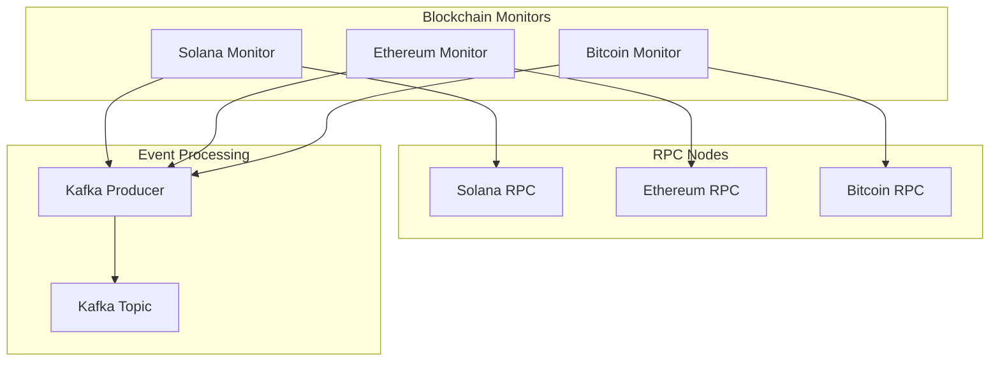
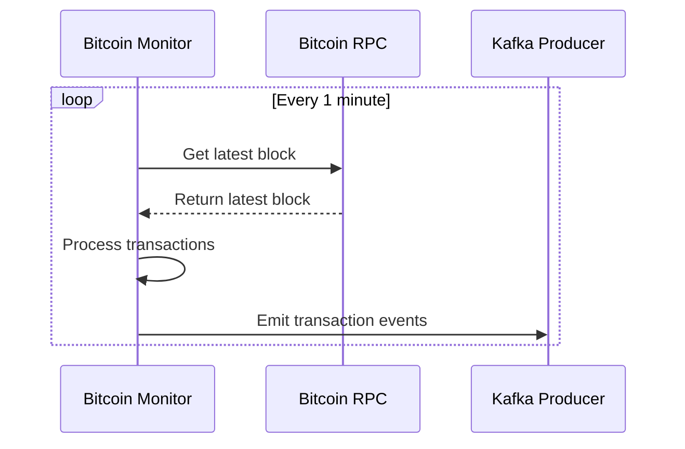
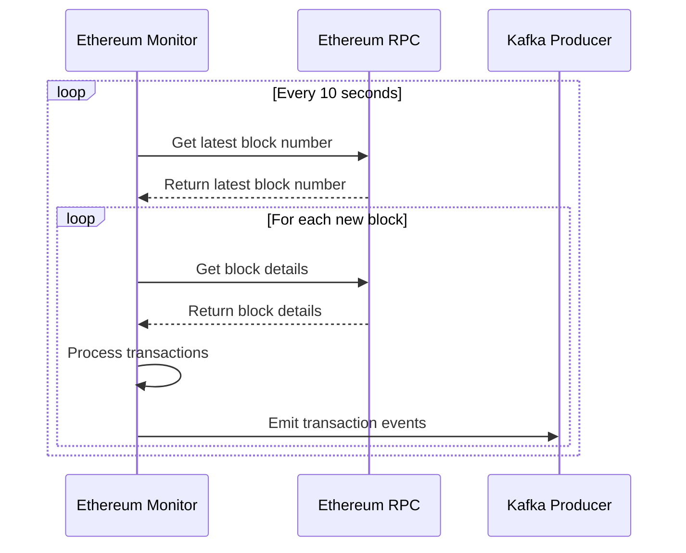
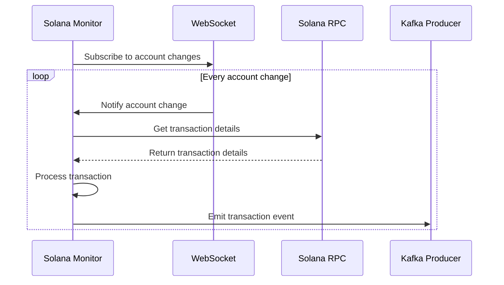
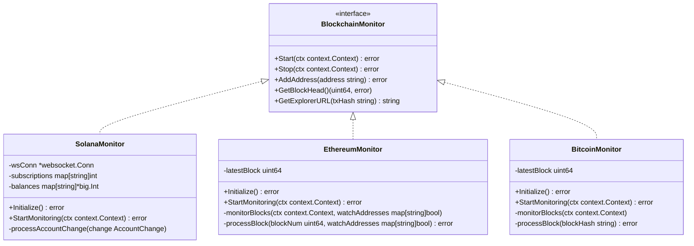

# Blockchain Transaction Monitor


* handle edge cases like retry situations:
    * block reorganization
        * the orphans blocks must be drop as the transactions
          it should stay in persisted but not include in any balance change
        * create a monitor to identify reorgs
    * how to not lose any txs in a 1h downtime scenario
        * when the current application status is store
          on startup if must load  the address to monitor, and the last scanned block
        
    * any other scenarios you want to showcase
        * if the api start return x error we should implement a circuit breaker, it can be an api error or and application error
        * run load tests to check any memory issue or even use a profiler 


* Next steps

    * persist wallets to data
        * userID
        * wallet address
        * balance
        * block
        * parent block
        * transaction hash
    * add kafka queue to manage the user wallets to monitor
    * add prometheus metrics
    * add monitoring 
    * create unit tests


* Known issues:
    * Ethereum fees calculator not working with EIP-1559
    * blockdaemon websocket not working, we wss is using Chainstack.

# Mermaid diagram to illustrate the solution

##  Architecture Diagram



## Bitcoin Architecture Diagram



## Ethereum Architecture Diagram


## Solan Architecture Diagram




## interfaces

### Blockchain Monitors




## Microservice healthcheck endpoint

### ready

http://127.0.0.1:8888/readyz

### heath

http://127.0.0.1:8888/healthz


# developer tools

* golang
* git

## build

```shell
go build ./cmd/ -o cmd
```


## run

```shell
go run ./cmd/
```

## Address configurations

The addresses to monitor are configured at [addresses](cmd/add_addresses.go)

Example

```go
 User{
    ID: "a4b21045-ea18-42f0-bfe0-798ed7f7a6cb",
    Addresses: map[models.BlockchainName][]string{
        models.Ethereum: {"0x95222290DD7278Aa3Ddd389Cc1E1d165CC4BAfe5"},
        models.Solana: {
            "5guD4Uz462GT4Y4gEuqyGsHZ59JGxFN4a3rF6KWguMcJ",
            "oQPnhXAbLbMuKHESaGrbXT17CyvWCpLyERSJA9HCYd7"},

        models.Bitcoin: {"bc1qamgjuxaywqls56h7rg7afga3m6rgqwfkew688k",
            "bc1qxy2kgdygjrsqtzq2n0yrf2493p83kkfjhx0wlh",
            "bc1qxy2kgdygjrsqtzq2n0yrf2493p83kkfjhx0wlh"},
    },
}
```

---

[//]: # (## Mandatory task)

[//]: # (Given a list of Bitcoin, Ethereum, and Solana addresses associated to a `userId` &#40;assume 1 per chain for example&#41;)

[//]: # (create a microservice in Golang that monitors the blockchains for any transactions involving those addresses.)

[//]: # ()
[//]: # (In summary, the service should:)

[//]: # ()
[//]: # (1. Connect via RPC to the Bitcoin, Ethereum, and Solana blockchains using Blockdaemon &#40;feel free to use another provider if you prefer&#41;.)

[//]: # ()
[//]: # (2. Consume the appropriate information to detect all future transactions that involve the specified addresses.)

[//]: # ()
[//]: # (3. For the filtered transactions, process the payload and output the following information:)

[//]: # (- Source)

[//]: # (- Destination)

[//]: # (- Amount)

[//]: # (- Fees)

[//]: # ()
[//]: # (This output should be in the form of an event emitted by a Kafka producer.)

[//]: # ()
[//]: # (The service should be designed for scalability, capable of processing blocks in real time &#40;be mindful of Solana's speed!&#41;.)

[//]: # ()
[//]: # (## Bonus task)

[//]: # (Not mandatory, but appreciated:)

[//]: # ()
[//]: # (Bonus 1: Add a Mermaid diagram to illustrate your solution.)

[//]: # ()
[//]: # (Bonus 2: Explain &#40;no need to code&#41; how you would handle edge cases like retry situations, block reorganization, how to not lose any txs in a 1h downtime scenario, and any other scenarios you want to showcase.)

## RPC Docs

You can use any RPC provider you want. If you need an example or reference

[RPC solana](https://docs.blockdaemon.com/reference/how-to-access-solana-api)

[RPC ethereum](https://docs.blockdaemon.com/reference/how-to-access-ethereum-api)

[RPC bitcoin](https://docs.blockdaemon.com/reference/how-to-access-bitcoin-api)


 