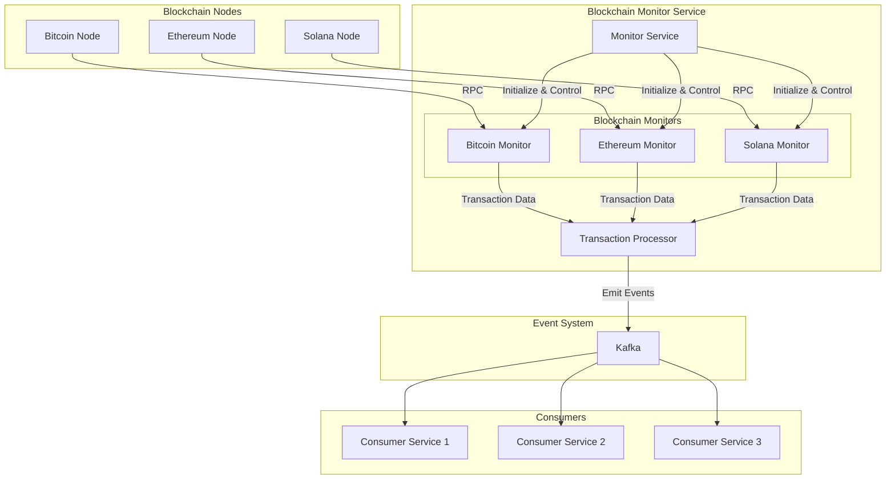

# Blockchain Transaction Monitor

## Architecture Diagram

```mermaid
graph TD
    subgraph "Blockchain Nodes"
        BTC[Bitcoin Node]
        ETH[Ethereum Node]
        SOL[Solana Node]
    end

    subgraph "Blockchain Monitor Service"
        MON[Monitor Service]
        subgraph "Blockchain Monitors"
            BTCM[Bitcoin Monitor]
            ETHM[Ethereum Monitor]
            SOLM[Solana Monitor]
        end
        PROC[Transaction Processor]
    end

    subgraph "Event System"
        KAFKA[Kafka]
    end

    subgraph "Consumers"
        C1[Consumer Service 1]
        C2[Consumer Service 2]
        C3[Consumer Service 3]
    end

    BTC --> |RPC| BTCM
    ETH --> |RPC| ETHM
    SOL --> |RPC| SOLM

    BTCM --> |Transaction Data| PROC
    ETHM --> |Transaction Data| PROC
    SOLM --> |Transaction Data| PROC

    PROC --> |Emit Events| KAFKA

    KAFKA --> C1
    KAFKA --> C2
    KAFKA --> C3

    MON --> |Initialize & Control| BTCM
    MON --> |Initialize & Control| ETHM
    MON --> |Initialize & Control| SOLM
```
